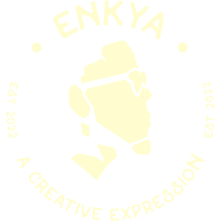

<a name="readme-top"></a>

[![Contributors][contributors-shield]][contributors-url]
[![Issues][issues-shield]][issues-url]
[![MIT License][license-shield]][license-url]
[![LinkedIn][linkedin-shield]][linkedin-url]

<br />
<div align="center">
  <a href="https://github.com/aenkya/playground">
    
  </a>

  <h3 align="center">Playground</h3>

  <p align="center">
    A backend focused project to facilitate projects by @aenkya
    <br />
    <a href="https://github.com/aenkya/playground/docs"><strong>Explore the docs »</strong></a>
    <br />
    <br />
    <a href="https://github.com/aenkya/playground/issues">Report Bug</a>
    ·
    <a href="https://github.com/aenkya/playground/issues">Request Feature</a>
  </p>
</div>


<!-- TABLE OF CONTENTS -->
<details>
  <summary>Table of Contents</summary>
  <ol>
    <li>
      <a href="#about-the-project">About The Project</a>
      <ul>
        <li><a href="#built-with">Built With</a></li>
      </ul>
    </li>
    <li>
      <a href="#getting-started">Getting Started</a>
      <ul>
        <li><a href="#prerequisites">Prerequisites</a></li>
        <li><a href="#installation">Installation</a></li>
      </ul>
    </li>
    <li><a href="#usage">Usage</a></li>
    <li><a href="#roadmap">Roadmap</a></li>
    <li><a href="#contributing">Contributing</a></li>
    <li><a href="#license">License</a></li>
    <li><a href="#contact">Contact</a></li>
    <li><a href="#acknowledgments">Acknowledgments</a></li>
  </ol>
</details>


<!-- ABOUT THE PROJECT -->
## About The Project

[![Playground Screen Shot][product-screenshot]](https://enkya.org)

This project is merely a playground to facilitate engineering principles across the board. It made more sense to me to actively contribute to one project and keep updating it to fit my needs as I go along. Primarily it has been developed with go. I have recently started expanding to cover python work

<p align="right">(<a href="#readme-top">back to top</a>)</p>


### Built With

This section should list any major frameworks/libraries used to bootstrap your project. Leave any add-ons/plugins for the acknowledgements section. Here are a few examples.

* [![Go][Go]][go-url]
* [![Python][Python]][python-url]

<p align="right">(<a href="#readme-top">back to top</a>)</p>


<!-- GETTING STARTED -->
## Getting Started

This is an example of how you may give instructions on setting up your project locally.
To get a local copy up and running follow these simple example steps.

### Prerequisites

You need to have `go` and `python` (3.3+) installed.

### Installation

1. Clone the repo
   ```sh
   git clone https://github.com/aenkya/playground.git
   ```
2. Run project
    - Using Docker
      You can run this service with `docker`. Either install the desktop client or run the command below.
      ```sh
      # run only one of these setup commands based on your OS
      make docker-setup-mac # for mac users
      make docker-setup-linux # for linux
      ```

      You can then run the project like shown below
      ```sh
      make docker-all
      ```
      
    - Running live on machine
      For development, you can use live-reload.
      ```sh
      make setup
      air
      ```
<p align="right">(<a href="#readme-top">back to top</a>)</p>


<!-- USAGE EXAMPLES -->
## Usage

Currently, you can review the code showing the examples explored so far and you can run their respective tests to explore the functions.
However, you can also update the main method of the go program and the main function of the python project to be able to call the appropriate functions

_For more examples and explorations, please refer to the [Documentation](docs)_

<p align="right">(<a href="#readme-top">back to top</a>)</p>


<!-- ROADMAP -->
## Roadmap

- [x] Add Changelog
- [x] Add back to top links
- [x] Update README
- [x] Dockerize application
- [ ] Expose APIs to access functionality
- [ ] Add networking features
- [ ] Implement more design patterns
- [ ] Create monorepo setup script
- [ ] Add more documentation
- [ ] Setup CI/CD pipeline and actions to enable deploy
- [ ] Add support for custom configuration loading

See the [open issues](https://github.com/aenkya/playground/issues) for a full list of proposed features (and known issues).

<p align="right">(<a href="#readme-top">back to top</a>)</p>


<!-- CONTRIBUTING -->
## Contributing

If you have a suggestion that would make this better, please fork the repo and create a pull request. You can also simply open an issue with the tag "enhancement".
Thanks!

1. Fork the Project
2. Create your Feature Branch (`git checkout -b feature/AmazingFeature`)
3. Commit your Changes (`git commit -m 'Add some AmazingFeature'`)
4. Push to the Branch (`git push origin feature/AmazingFeature`)
5. Open a Pull Request

<p align="right">(<a href="#readme-top">back to top</a>)</p>


<!-- LICENSE -->
## License

Distributed under the MIT License. See `LICENSE.txt` for more information.

<p align="right">(<a href="#readme-top">back to top</a>)</p>


<!-- CONTACT -->
## Contact

Bruce - [@aenkya](https://twitter.com/aenkya) - info@enkya.org

Project Link: [https://github.com/aenkya/playground](https://github.com/aenkya/playground)

<p align="right">(<a href="#readme-top">back to top</a>)</p>


## Acknowledgments

Use this space to list resources you find helpful and would like to give credit to. I've included a few of my favorites to kick things off!

* [Img Shields](https://shields.io)
* [README Template](https://github.com/othneildrew/Best-README-Template)

<p align="right">(<a href="#readme-top">back to top</a>)</p>


<!-- MARKDOWN LINKS & IMAGES -->
<!-- https://www.markdownguide.org/basic-syntax/#reference-style-links -->
[contributors-shield]: https://img.shields.io/github/contributors/aenkya/playground?style=for-the-badge
[contributors-url]: https://github.com/aenkya/playground/graphs/contributors?style=for-the-badge
[issues-shield]: https://img.shields.io/github/issues/aenkya/playground?style=for-the-badge
[issues-url]: https://github.com/aenkya/playground/issues?style=for-the-badge
[license-shield]: https://img.shields.io/github/license/aenkya/playground.svg?style=for-the-badge
[license-url]: https://github.com/aenkya/playground/blob/master/LICENSE.txt
[linkedin-shield]: https://img.shields.io/badge/-LinkedIn-black.svg?style=for-the-badge&logo=linkedin&colorB=555
[linkedin-url]: https://linkedin.com/in/aenkya
[product-screenshot]: docs/images/product-screenshot.png
[Go]: https://img.shields.io/github/go-mod/go-version/aenkya/playground
[go-url]: https://go.dev
[Python]: https://img.shields.io/pypi/pyversions/3
[Python-url]: https://python.org